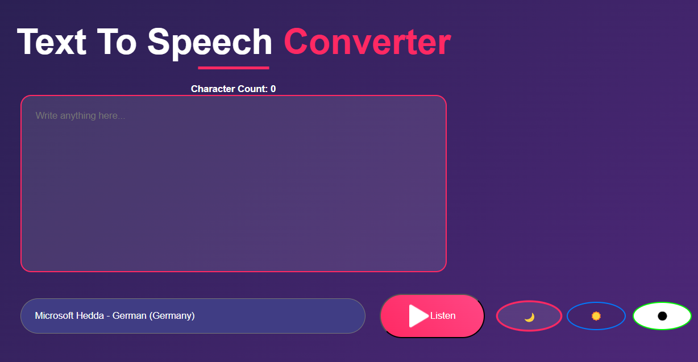

# 🎧 **Text-to-Speech Converter**

  
*Live demo: [Try it here]( )*  
[](LICENSE)

## 🛠 Features

### Core Functionality
1. **Web Speech API Integration**  
   - Implements `SpeechSynthesisUtterance` for browser-native speech generation
   - Dynamic voice selection from 50+ system voices
   - Real-time character counting with `input` event listener

2. **Stateful UI Controls**  
   - Pause/resume speech synthesis with `speechSynthesis.pause()`/`.resume()`
   - Voice selector dropdown populated via `getVoices()` API

3. **Theme Engine**  
   - CSS custom properties with `data-theme` attribute switching
   - localStorage persistence for user preferences

### Advanced Features
1. **Error Resilience**  
   - Speech state validation (`speaking`/`paused` checks)
   - Empty input prevention with `trim()` validation

2. **Performance**  
   - Debounced character counter updates
   - Voice caching after initial fetch

## 🏗 Architecture Highlights

### 1. Web Speech API Initialization
```javascript
// Core speech initialization
const speech = new SpeechSynthesisUtterance();

window.speechSynthesis.onvoiceschanged = () => {
  voices = window.speechSynthesis.getVoices();
  speech.voice = voices[0]; // Default voice
  voiceSelect.innerHTML = voices.map((v, i) => 
    `<option value="${i}">${v.name}</option>`
  ).join('');
};
```

### 2. Theme Management System
```javascript
// Theme persistence implementation
const activateTheme = (theme) => {
  document.body.setAttribute('data-theme', theme);
  localStorage.setItem('theme', theme);
  // Updates button states using dataset comparison
  themeButtons.forEach(btn => 
    btn.classList.toggle('active', btn.dataset.theme === theme)
  );
};
```

## 🖥 Tech Stack

### Frontend


### Browser APIs


### Tooling


## ⚙ System Requirements

- **Browsers:** Chrome 70+, Firefox 49+, Edge 79+
- **Web Speech API:** Requires HTTPS in production
- **Audio Output:** Functional speakers/headphones


# No dependencies - pure browser implementation


## 🚀 Development Workflow

1. **Local Setup**
   git clone 
   cd text-to-speech
   # Open index.html in modern browser


## 📚 Learning Outcomes

### Architectural Patterns
- **Modular Event Handling:** Decoupled UI controls from speech engine
- **State Management:** Voice/theme persistence without external libraries


## 📜 License & Contact

[MIT License](LICENSE) • © 2025 Alain Nkw 

[](https://github.com/NKWILI)
[](https://www.linkedin.com/in/alain-ngongang-0b57ab19a/)


